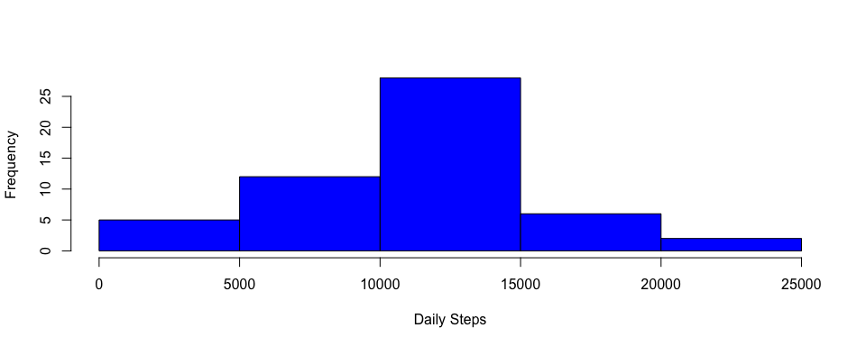
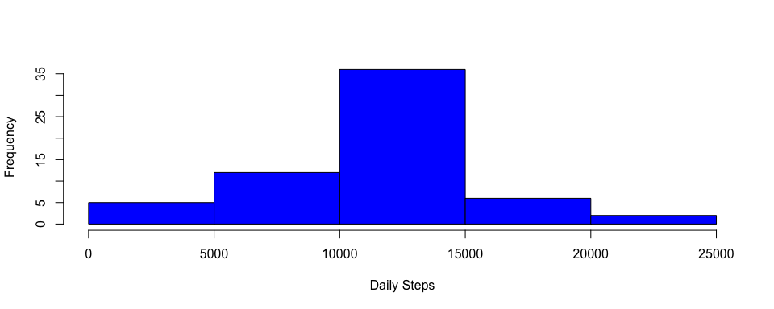
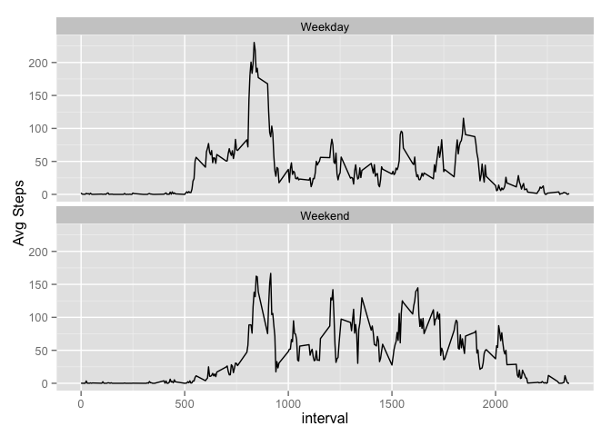

# Reproducible Research: Peer Assessment 1


## Loading and preprocessing the data

1. Download and unzip the activity.csv file to your working directory
2. Read the activity.csv file into R and convert the date column to a date class


```r
data <- read.csv("activity.csv", stringsAsFactors = FALSE)
data$date <- as.Date(data$date, "%Y-%m-%d")
summary(data)
```

```
##      steps             date               interval     
##  Min.   :  0.00   Min.   :2012-10-01   Min.   :   0.0  
##  1st Qu.:  0.00   1st Qu.:2012-10-16   1st Qu.: 588.8  
##  Median :  0.00   Median :2012-10-31   Median :1177.5  
##  Mean   : 37.38   Mean   :2012-10-31   Mean   :1177.5  
##  3rd Qu.: 12.00   3rd Qu.:2012-11-15   3rd Qu.:1766.2  
##  Max.   :806.00   Max.   :2012-11-30   Max.   :2355.0  
##  NA's   :2304
```

## What is mean total number of steps taken per day?

First, let's summarize the data into total number of steps taken by day and look at a histogram of the data


```r
stepsbyday <- aggregate(data$steps, list(date = data$date), sum, simplify = TRUE)
hist(as.numeric(stepsbyday$x), col = "blue", main = "", xlab = "Daily Steps", ylab = "Frequency")
```

 

Then we can use our summarized data to calculate the mean and median steps taken per day:

-Mean:

```r
mean(stepsbyday$x, na.rm = TRUE)
```

```
## [1] 10766.19
```

-Median:

```r
median(stepsbyday$x, na.rm = TRUE)
```

```
## [1] 10765
```

## What is the average daily activity pattern?

Let's first summarize the data into average number of steps per five minute interval and then take a look at a line plot of the data


```r
stepsbymin <- aggregate(data$steps, list(interval = data$interval), mean, na.rm = TRUE, na.action = NULL)
plot(stepsbymin$interval, stepsbymin$x, type = "l", xlab = "Time Interval", ylab = "Avg. # of Steps Taken")
```

 

The maximum number of steps can be found in the time interval:


```r
ordered_steps <- stepsbymin[order(-stepsbymin$x),]
ordered_steps[1,1]
```

```
## [1] 835
```


## Imputing missing values
If we subset the number of rows that contain "NA" values, we'll find that of 17,568 observations, the number of "NA" values is:


```r
na_subset <- subset(data, is.na(data$steps))
nrow(na_subset)
```

```
## [1] 2304
```

Because the presence of missing days may introduce bias into some calculations or summaries of the data, we can try to offset this by replacing the NA values with real numbers. In this case, I used the average number of steps per five minute interval as replacement values for the "NA" observations. A summary of the new set shows that there are no "NA" values remaining.


```r
good_subset <- subset(data, !is.na(data$steps))
library(plyr)
na_subset2 <- join(na_subset,stepsbymin, by = "interval", type = "left")
na_subset3 <- na_subset2[, c(4,2,3)]
colnames(na_subset3)<- c("steps", "date", "interval")
complete_set <- rbind(good_subset, na_subset3)
summary(complete_set)
```

```
##      steps             date               interval     
##  Min.   :  0.00   Min.   :2012-10-01   Min.   :   0.0  
##  1st Qu.:  0.00   1st Qu.:2012-10-16   1st Qu.: 588.8  
##  Median :  0.00   Median :2012-10-31   Median :1177.5  
##  Mean   : 37.38   Mean   :2012-10-31   Mean   :1177.5  
##  3rd Qu.: 27.00   3rd Qu.:2012-11-15   3rd Qu.:1766.2  
##  Max.   :806.00   Max.   :2012-11-30   Max.   :2355.0
```

For comparison, below is a histogram of the total number of steps taken by day using the new dataset.


```r
est_steps <- aggregate(complete_set$steps, list(date = complete_set$date), sum, simplify = TRUE)
hist(as.numeric(est_steps$x), col = "blue", main = "", xlab = "Daily Steps", ylab = "Frequency")
```

 

As well as the new mean and median steps taken per day

-Mean:

```r
mean(est_steps$x, na.rm = TRUE)
```

```
## [1] 10766.19
```

-Median:

```r
median(est_steps$x, na.rm = TRUE)
```

```
## [1] 10766.19
```

It appears that the data are not different for mean, but have increased by ~1 step per day for the median.

## Are there differences in activity patterns between weekdays and weekends?

If we want to determine if there are any differences in activity patterns between weekdays and weekends, the data must first be labeled with whether an observation was taken on a weekend or a weekday. The transformation below used the weekdays() function and then created a lookup table to categorize each day of the week.


```r
#create weekday data for each observation
dow <- weekdays(complete_set$date, abbreviate = FALSE)
#create a lookup table for each day of week to determine if weekend or not
weekday_table <- data.frame("dow" =c("Sunday","Monday","Tuesday","Wednesday","Thursday","Friday","Saturday"),"type" =c("Weekend","Weekday","Weekday","Weekday","Weekday","Weekday","Weekend"))
library(plyr)
#cbind the weekday data to the original (filled-in) dataset
dow_data <- cbind(complete_set, dow)
#Use the lookup table to classify the day of week as "weekend" or "weekday"
dow_type <- join(dow_data,weekday_table, by = "dow", type = "left")
summary(dow_type)
```

```
##      steps             date               interval             dow      
##  Min.   :  0.00   Min.   :2012-10-01   Min.   :   0.0   Friday   :2592  
##  1st Qu.:  0.00   1st Qu.:2012-10-16   1st Qu.: 588.8   Monday   :2592  
##  Median :  0.00   Median :2012-10-31   Median :1177.5   Saturday :2304  
##  Mean   : 37.38   Mean   :2012-10-31   Mean   :1177.5   Sunday   :2304  
##  3rd Qu.: 27.00   3rd Qu.:2012-11-15   3rd Qu.:1766.2   Thursday :2592  
##  Max.   :806.00   Max.   :2012-11-30   Max.   :2355.0   Tuesday  :2592  
##                                                         Wednesday:2592  
##       type      
##  Weekday:12960  
##  Weekend: 4608  
##                 
##                 
##                 
##                 
## 
```

In order to compare weekend activity pattern to weekday activity pattern, we can put together a panel plot of interval vs. average steps, with weekday and weekend each being a facet.


```r
library(ggplot2)
steps_agg <- aggregate(dow_type$steps, list(interval = dow_type$interval, type = dow_type$type), mean, simplify = TRUE)
ggplot(steps_agg, aes(interval,x))+ylab("Avg Steps")+geom_line(color="black")+facet_wrap(~type, nrow=2)
```

 

There appears to be a more consistent level of activity on the weekend days, whereas weekdays appear to spike at the beginning of the day before leveling off.
